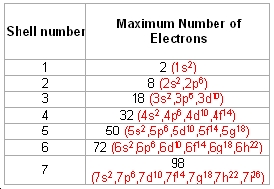

# Chemistry

## Chapter 1

* **Sublimation** - Where a substance goes directly between solid and gas rather than to liquid at any point (e.g. *carbon dioxide*)

* **Diffusion** - The spreading out of gas or liquid particles

Lighter particles in a gas travel much faster than heavier ones.

## Chapter 2

* **atomic number** = number of protons
* **mass number** = number of protons + neutrons
* **Isotopes** are elements with the same number of protons but with a different amount of neutron
* number of electrons = number of neutrons

### Arrangement of the electrons

* The electrons are found at considerable distances from the nucleus in a series of levels called **energy levels** or **shells**

* Each level can only hold a certain amount of electrons.

* The formula for maximum amount of electrons per shell is **2n2**.

* Lower levels are always filled before the higher ones

#### How to work out the arrangement of electrons

* Find out the number of protons for the atom
* Assume the same amount of neutrons as neutrons for a neutral atom
* Arrange the electrons in layers, slowly filling them up

## Chapter 3

### Covalent Bonds

A covalent bond is where two atoms share a pair of electrons.

### Ionic (electrovalent) Bonds

An ionic bond is where two atoms share a single electron, and one of the atoms pulls the electron very close to itself, and becomes negatively charged. The atom loosing the electron becomes positively charged.

* A positive ion is called a **cation**.
* A negative ion is called an **anion**.

### Metallic Bonds

In a metallic bond, neutral metallic atoms lose their negatively-charged electrons into the surrondings, and thusly become postitvely charged.

## Chapter 4

There are two types of strutures, **giant** and **molecular**.

### Giant metallic structures

* **Giant metallic structures** consist of a regular array of posititve ions in a sea of delocalised electrons.

Metals are generally good conductors of heat and electricity. They also typically have a maliable structure.

If a small force is exerted onto a metal, some of the particles move into their new positions.

### Alloys

An alloy is a mixture of metals; a metallic compound.

* **Brass** is a mixture of copper and zinc.

### Giant ionic structures

* *Ionic compounds have high melting points and boiling points because of strong intermolecular forces holding the lattices together.*
